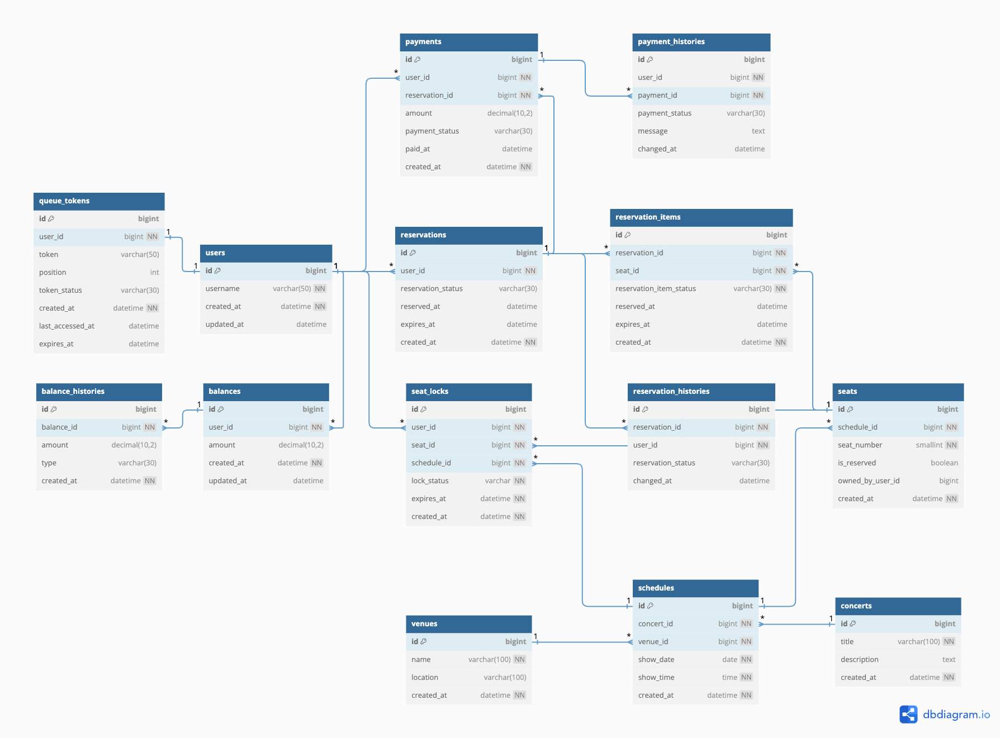
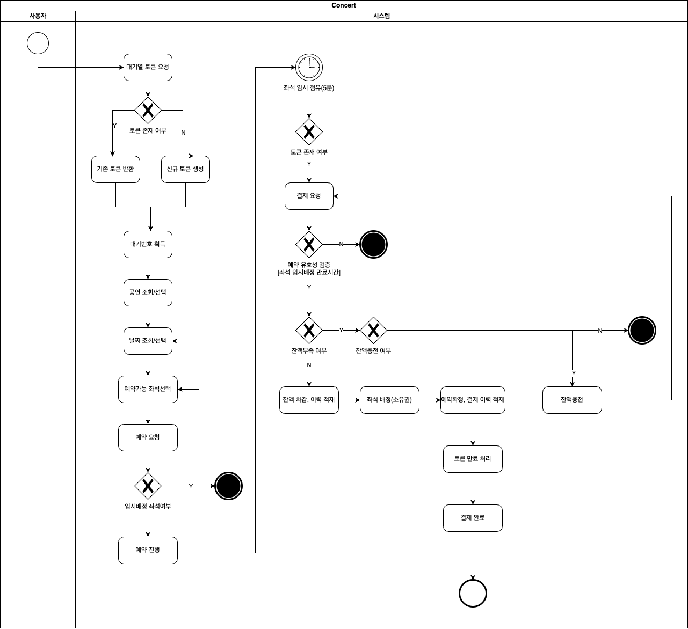
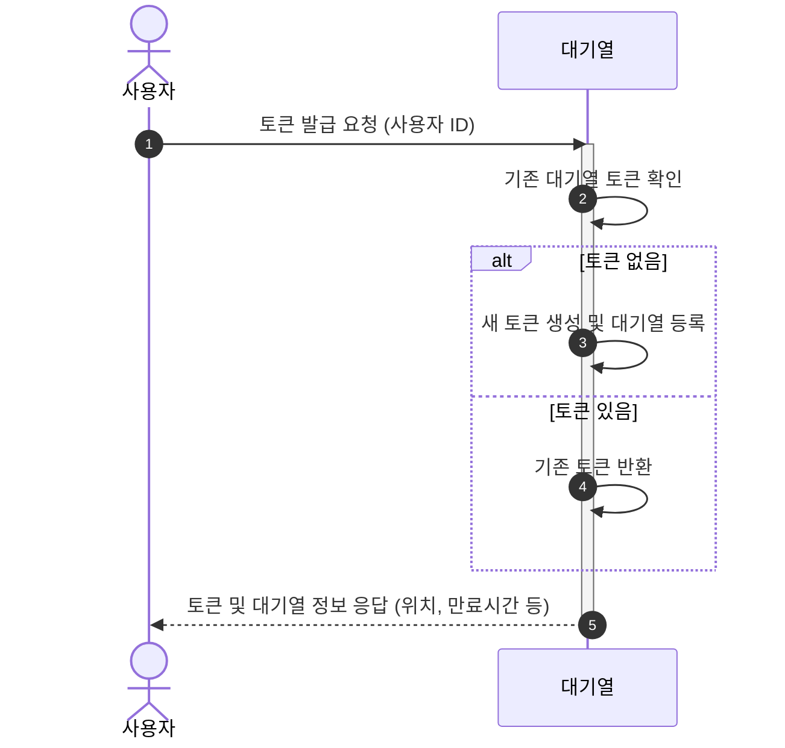
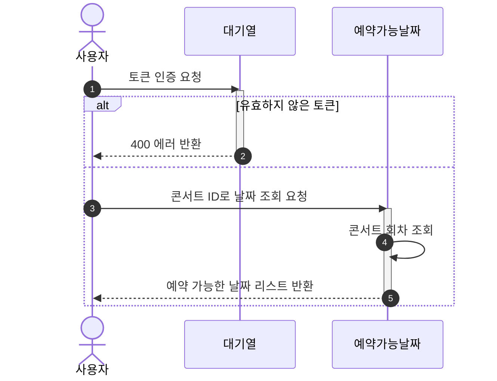
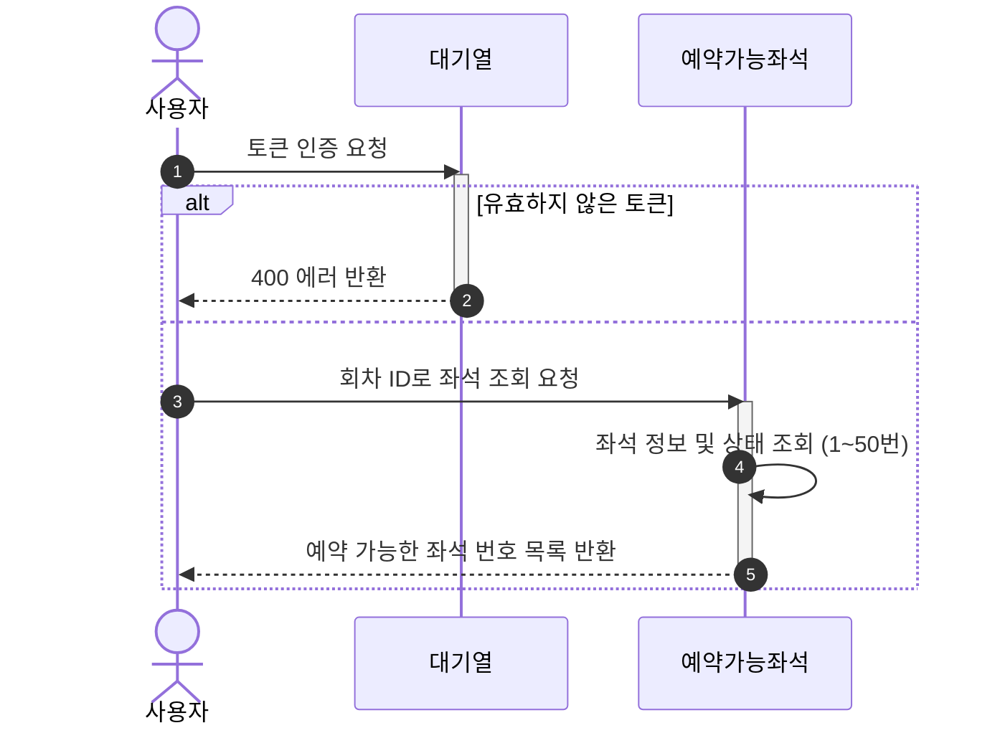
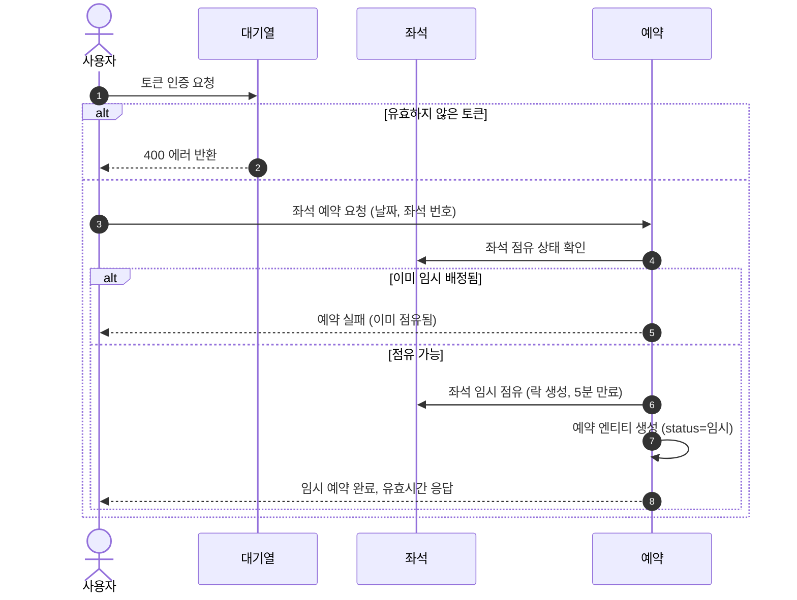
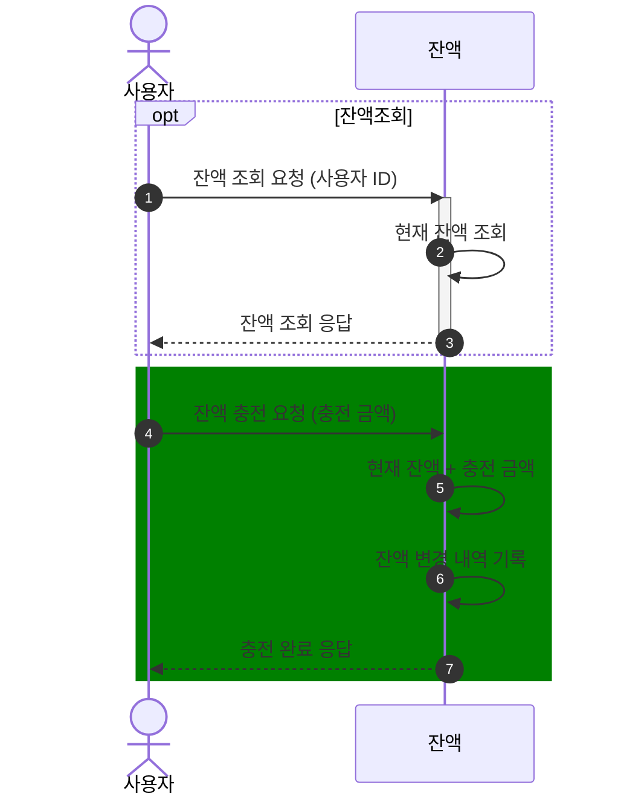
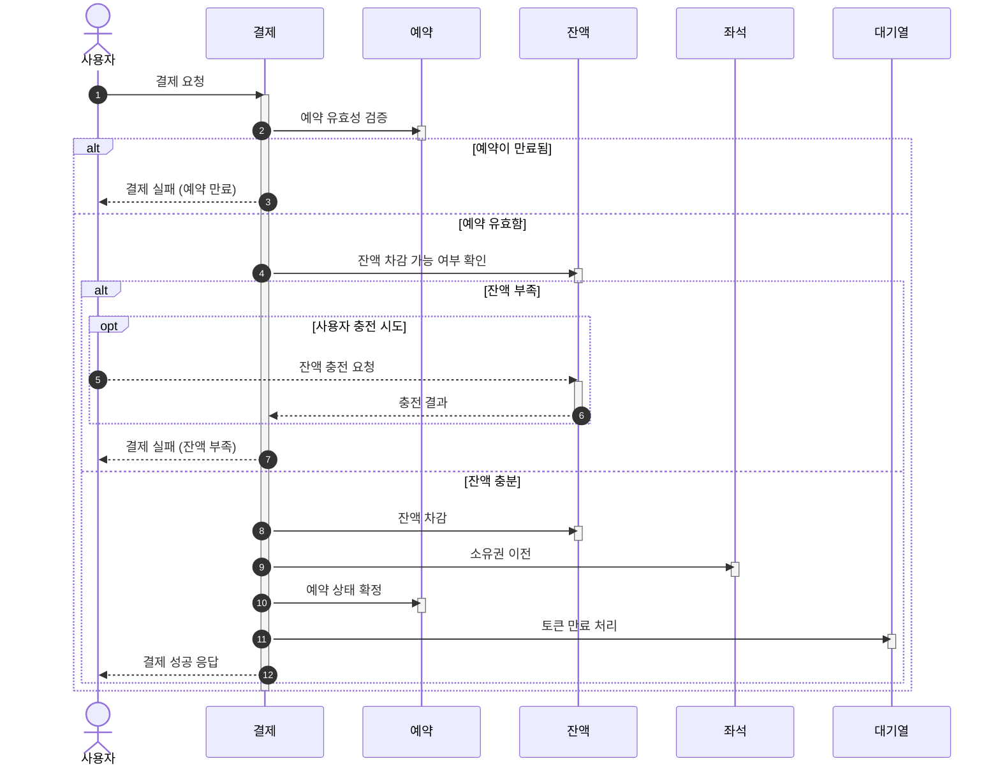

# 📚 요구사항 분석 및 설계

## 📊 ERD

 

## 〽️ Flowchart

 

## 🎼 시퀀스 다이어그램

<strong>1. 대기열 토큰 발급 API</strong>

 

<strong>2. 예약가능날짜 API</strong>

 

<strong>3. 예약 가능 좌석 조회 API</strong>

 

<strong>4. 좌석 예약 API</strong>

 

<strong>4. 잔액 조회 및 충전 API</strong>

 

<strong>5. 결제 API</strong>

